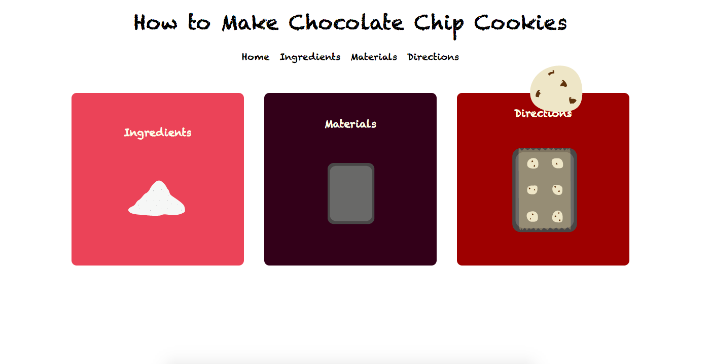

# Chocolate Chip Cookie Website
A website with instructions on how to make chocolate chip cookies.

## Table of contents
* [General info](#general-info)
* [Website link](#website-link)
* [Technologies](#technologies)
* [Status](#status)

## General info
Using text, visuals, and animations, the website gives a detailed explanation on
how to make soft chocolate chip cookies. It is separated into three sections: ingredients,
materials, and directions.

I made it for fun as my first ever website.

## Website link
https://joonqkr.github.io/chocolate-chips/

## Technologies
* HTML
* CSS
* Javascript
* Adobe Illustrator

## Status
Project is: _tentatively finished_.

It serves its main purpose, but possible adjustments: compatibility with mobile and varying screen sizes.
